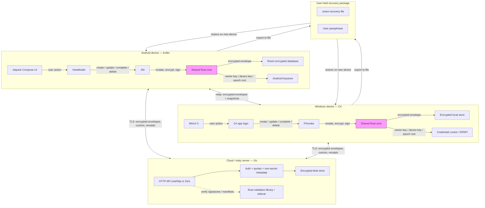

# Architecture data flow

This document describes how user task data, keys, and encrypted envelopes flow through the Eisen system, and which programming language owns each boundary.

The language choices are recorded in ADR-001 (Android, Windows, and the shared Rust core) and ADR-012 (Go server).

## High-level data flow

## Components and languages

| Component | Language | Responsibility |
|---|---|---|
| Android UI, lifecycle, and local persistence | Kotlin | User interaction, background sync, encrypted local storage |
| Windows UI, lifecycle, and local persistence | C# | User interaction, background sync, encrypted local storage |
| Shared core | Rust | Canonical encoding, HLC, mutation/merge, envelope encryption/signing, manifest-chain verification |
| Android secure storage | Kotlin + Android Keystore | Store owner key, device key, and epoch roots |
| Windows secure storage | C# + Credential Locker / DPAPI | Store owner key, device key, and epoch roots |
| Cloud / relay server | Go | Accept, store, and serve opaque encrypted blobs; manage auth, quotas, and cursors |
| Server-side validation | Rust (optional FFI or sidecar) | Verify envelope and manifest structure/signatures without decrypting content |
| Recovery package | File format | User-held encrypted backup of keyring and trust state |

## Key data-flow rules

1. **Plaintext task content never leaves the device.** The Rust core encrypts tasks into signed envelopes before storage, transport, or sync.
2. **The server is an opaque blob store.** It cannot decrypt envelopes, read task content, or recover passphrases.
3. **The shared Rust core is compiled into each client app.** It is not a remote service. Android calls it through JNI; Windows calls it through P/Invoke.
4. **Device keys and owner keys live in platform secure storage.** The Rust core receives them at call time but does not persist them itself.
5. **Recovery packages are user-held.** They contain encrypted keyring and trust material; the service cannot create, read, or reset them.

## Future platforms

The same shared Rust core can be compiled for iOS and macOS and exposed to Swift through a C API / bridging header. Platform secure storage would use the Apple Keychain. iOS/macOS support is not yet in the approved native-stack ADR (ADR-001) and would require an explicit ADR update.
