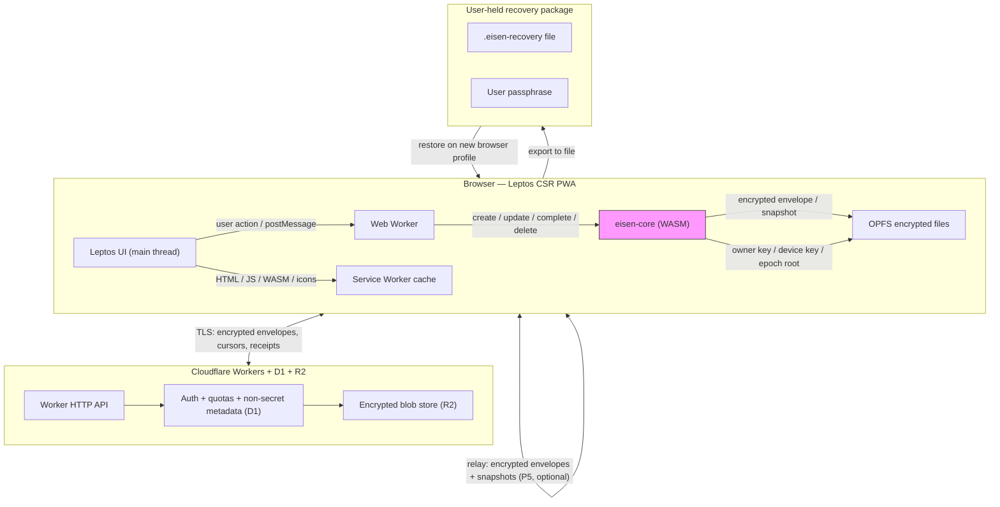

# Architecture data flow

This document describes how user task data, keys, and encrypted envelopes flow through the Eisen system, and which technology owns each boundary.

The stack choices are recorded in ADR-001 (Leptos PWA and Rust/WASM core) and ADR-012 (Cloudflare Workers + D1 + R2).

## High-level data flow

```mermaid
flowchart TB
    subgraph Browser["Browser — Leptos CSR PWA"]
        UI["Leptos UI (main thread)"]
        Worker["Web Worker"]
        Core["eisen-core (WASM)"]
        Opfs["OPFS encrypted files"]
        SW["Service Worker cache"]

        UI -->|"user action / postMessage"| Worker
        Worker -->|"create / update / complete / delete"| Core
        Core -->|"encrypted envelope / snapshot"| Opfs
        Core -->|"owner key / device key / epoch root"| Opfs
        UI -->|"HTML / JS / WASM / icons"| SW
    end

    subgraph Cloudflare["Cloudflare Workers + D1 + R2"]
        API["Worker HTTP API"]
        Auth["Auth + quotas + non-secret metadata (D1)"]
        Blob["Encrypted blob store (R2)"]

        API --> Auth
        Auth --> Blob
    end

    subgraph Recovery["User-held recovery package"]
        R_FILE[".eisen-recovery file"]
        R_PASS["User passphrase"]
    end

    Browser <-->|"TLS: encrypted envelopes, cursors, receipts"| Cloudflare
    Browser <-->|"relay: encrypted envelopes + snapshots (P5, optional)"| Browser
    Browser -->|"export to file"| Recovery
    Recovery -->|"restore on new browser profile"| Browser

    style Core fill:#f9f,stroke:#333
```

## Components and languages

| Component | Language / Technology | Responsibility |
|---|---|---|
| PWA UI | Leptos 0.8 CSR (Rust) | User interaction, install / URL fallback flow, main-thread view |
| Core worker | Rust compiled to WASM | Canonical encoding, HLC, mutation/merge, envelope encryption/signing, manifest-chain verification |
| Browser storage | OPFS + Web Crypto | `OpfsSecureStorage` and `OpfsClockStorage` in an encrypted OPFS file |
| Service worker | JavaScript | Offline caching of shell assets; no vault data in cache |
| Cloudflare worker | TypeScript (`wrangler`) | Accept, store, and serve opaque encrypted blobs; manage auth, quotas, cursors |
| Metadata store | Cloudflare D1 | Account metadata, device manifest references, cursors, envelope references |
| Blob store | Cloudflare R2 | Encrypted envelopes, signed snapshots, recovery backups |
| Server-side validation | Rust/WASM or TypeScript | Verify envelope and manifest structure/signatures without decrypting content |
| Recovery package | File format | User-held encrypted backup of keyring and trust state |

## Key data-flow rules

1. **Plaintext task content never leaves the device.** The Rust core encrypts tasks into signed envelopes before storage, transport, or sync.
2. **The server is an opaque blob store.** It cannot decrypt envelopes, read task content, or recover passphrases.
3. **The shared Rust core runs in a Web Worker inside the browser.** It is compiled to WASM and talks to the Leptos UI through `postMessage`.
4. **Device keys and owner keys are stored in the encrypted OPFS file.** The Rust core receives them at call time but does not persist plaintext outside the encrypted file.
5. **Recovery packages are user-held.** They contain encrypted keyring and trust material; the service cannot create, read, or reset them.
6. **The service worker only caches the app shell.** It must not cache decrypted task data, keys, or passphrases.

## Platforms

The PWA runs on any modern browser that supports Web Crypto, OPFS, Service Workers, and Web App Manifest. Installability is optional; the URL is the app.

The previous native Windows (C# / WinUI 3) and Android (Kotlin / Jetpack Compose) clients are out of scope.
