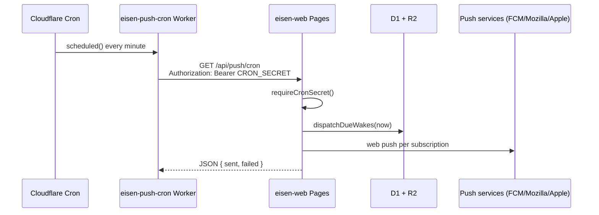

# Push Cron Worker — Research

**Date:** 2026-08-27  
**Scope:** Standalone Cloudflare Worker with Cron Triggers to dispatch Eisen push wakes  
**Context:** Eisen (`eisen-web`) runs on Cloudflare Pages; Pages does not support Cron Triggers

---

## Executive summary

**Recommended approach:** Deploy a minimal standalone Worker (`eisen-push-cron`) whose only job is to run on a Cron Trigger and call the existing Pages endpoint `GET /api/push/cron` with `Authorization: Bearer <CRON_SECRET>`. Keep all wake dispatch logic in the Pages app (D1, VAPID, `dispatchDueWakes`). Use **public HTTPS fetch** to the production URL (`BETTER_AUTH_URL`) rather than a service binding for the first implementation — it matches Cloudflare’s cron examples, needs no Pages wrangler changes, and reuses the already-authenticated route.

After the cron Worker is live and verified, **remove** `tools/patch-cloudflare-worker.mjs` and its `build` hook — the Pages `scheduled()` handler never runs on Pages and adds dead code.

On Workers Free: one cron schedule (`* * * * *`) uses 1 of 5 account cron triggers and ~1,440 Worker invocations/day plus ~1,440 Pages Function invocations (~2,880 requests/day total), well under the 100,000/day limit. Watch the **10 ms CPU time per Cron Trigger** cap on Free; if dispatch exceeds it, use `*/5 * * * *` or upgrade to Workers Paid.

---

## Problem

Eisen stores wake schedules in D1 and dispatches them via `GET /api/push/cron`, protected by `CRON_SECRET`:

```6:12:src/routes/api/push/cron/+server.ts
export const GET: RequestHandler = async (event) => {
	requireCronSecret(event);
	const env = event.platform?.env;
	if (!env) throw error(500, 'Platform env not configured');
	const mirror = createMirrorFromEnv(env);
	const result = await mirror.dispatchDueWakes(Date.now());
	return json(result);
};
```

Cloudflare **Pages does not support Cron Triggers**. The official Pages → Workers compatibility matrix lists Cron Triggers as ✅ Workers / ❌ Pages:

| | Workers | Pages |
| --- | --- | --- |
| Cron Triggers | ✅ | ❌ |

Source: [Migrate from Pages to Workers — Compatibility matrix](https://developers.cloudflare.com/workers/static-assets/migration-guides/migrate-from-pages/)

The repo’s `tools/patch-cloudflare-worker.mjs` injects a `scheduled()` handler into the Pages `_worker.js`, but without a Cron Trigger on Pages that handler never fires. README and settings UI still refer to configuring cron on the Pages project, which cannot work.

---

## Architecture

### Target (separate cron Worker)



### ASCII equivalent

```
┌─────────────────┐     Cron Trigger (* * * * *)     ┌──────────────────────┐
│  Cloudflare     │ ───────────────────────────────► │  eisen-push-cron     │
│  scheduler      │         scheduled()              │  (standalone Worker) │
└─────────────────┘                                  └──────────┬───────────┘
                                                                │
                     GET /api/push/cron                         │
                     Bearer CRON_SECRET                         ▼
┌─────────────────┐                                  ┌──────────────────────┐
│  Push endpoints │ ◄── web push ───────────────── │  eisen-web (Pages)   │
│  (browser vendors)│                              │  /api/push/cron      │
└─────────────────┘                                  └──────────┬───────────┘
                                                                │
                                                                ▼
                                                       D1 (wakes, subscriptions)
```

---

## Step-by-step implementation

### 1. Create the cron Worker package

Suggested layout (separate from Pages build):

```
workers/push-cron/
  src/index.ts
  wrangler.toml
  .dev.vars.example
```

**`workers/push-cron/src/index.ts`**

```typescript
interface Env {
	CRON_SECRET: string;
	TARGET_ORIGIN: string;
}

export default {
	async scheduled(_controller, env, _ctx) {
		if (!env.CRON_SECRET || !env.TARGET_ORIGIN) {
			console.error('push-cron: missing CRON_SECRET or TARGET_ORIGIN');
			return;
		}
		const url = new URL('/api/push/cron', env.TARGET_ORIGIN);
		const response = await fetch(url, {
			headers: { Authorization: `Bearer ${env.CRON_SECRET}` }
		});
		if (!response.ok) {
			const body = await response.text();
			console.error(`push-cron: ${response.status} ${body.slice(0, 200)}`);
		}
	}
};
```

**`workers/push-cron/wrangler.toml`**

```toml
"$schema" = "../../node_modules/wrangler/config-schema.json"
name = "eisen-push-cron"
main = "src/index.ts"
compatibility_date = "2025-07-18"

[triggers]
crons = ["* * * * *"]

[vars]
# Production origin — same value as BETTER_AUTH_URL on Pages (e.g. https://eisen.example.com)
TARGET_ORIGIN = "https://your-production-domain"

[secrets]
required = ["CRON_SECRET"]
```

Cron schedule uses UTC ([Cron Triggers](https://developers.cloudflare.com/workers/configuration/cron-triggers/)). `* * * * *` = every minute (matches README and settings UI).

### 2. Secrets and variables

| Variable | Where | Notes |
| --- | --- | --- |
| `CRON_SECRET` | Cron Worker secret + Pages secret (already set) | **Must be identical** on both sides |
| `TARGET_ORIGIN` | Cron Worker `vars` (or secret if preferred) | Same as Pages `BETTER_AUTH_URL` — no trailing slash |

**Pages:** `CRON_SECRET` is already a Pages encrypted variable.

**Cron Worker — set secret (must match Pages):**

```bash
cd workers/push-cron
npx wrangler secret put CRON_SECRET
```

`wrangler secret put` creates a new Worker version and deploys immediately ([Secrets](https://developers.cloudflare.com/workers/configuration/secrets/)).

**Local dev:** `workers/push-cron/.dev.vars`:

```
CRON_SECRET=your-local-secret
TARGET_ORIGIN=http://localhost:8788
```

Do not commit `.dev.vars` ([Local development with secrets](https://developers.cloudflare.com/workers/local-development/environment-variables/)).

### 3. Deploy

```bash
cd workers/push-cron
npx wrangler deploy
```

Standalone Workers deploy with `wrangler deploy` ([Workers deploy command](https://developers.cloudflare.com/workers/wrangler/commands/workers/#deploy)). No `pages_build_output_dir` — this is not a Pages project.

Cron triggers in wrangler replace dashboard triggers when managed by Wrangler ([Cron Triggers — Update configuration](https://developers.cloudflare.com/workers/configuration/cron-triggers/)). Propagation can take several minutes (up to ~15).

### 4. Test locally

```bash
cd workers/push-cron
npx wrangler dev --test-scheduled
```

In another terminal, run Pages preview if needed:

```bash
npm run preview
```

Trigger the scheduled handler:

```bash
curl "http://localhost:8787/cdn-cgi/handler/scheduled?format=json"
```

Or with explicit cron pattern:

```bash
curl "http://localhost:8787/cdn-cgi/handler/scheduled?cron=*+*+*+*+*&format=json"
```

([Scheduled handler — local testing](https://developers.cloudflare.com/workers/runtime-apis/handlers/scheduled/), [Cron Trigger example](https://developers.cloudflare.com/workers/examples/cron-trigger/))

### 5. Verify production

```bash
# Manual check of the Pages route (same auth the cron Worker uses)
curl -s -H "Authorization: Bearer $CRON_SECRET" "https://<your-domain>/api/push/cron"
```

In dashboard: Worker **eisen-push-cron** → Settings → Trigger Events → **View events** (last 100 cron runs).

### 6. Optional CI job

Add a workflow step after Pages deploy (or a separate job):

```yaml
- name: Deploy push cron Worker
  run: npx wrangler deploy --config workers/push-cron/wrangler.toml
  env:
    CLOUDFLARE_API_TOKEN: ${{ secrets.CLOUDFLARE_API_TOKEN }}
```

Set `TARGET_ORIGIN` in `wrangler.toml` or via dashboard; keep `CRON_SECRET` out of the repo.

---

## Public URL vs service binding

| Approach | Pros | Cons |
| --- | --- | --- |
| **Public HTTPS fetch** (`TARGET_ORIGIN`) | Documented in cron examples; no Pages wrangler changes; works with custom domain and `pages.dev`; easy to test with `curl` | Request leaves cron Worker via HTTP(S); Pages invocation counts as a Function request |
| **Service binding** to Pages Worker | Zero internet hop; lower latency; [no extra request fee](https://developers.cloudflare.com/workers/platform/pricing/#service-bindings) on Standard pricing | Docs emphasize Pages → Worker bindings; binding cron Worker → Pages project (`eisen-web`) is less documented — verify in dashboard that the Pages deployment appears as a bindable service; requires `[[services]]` in cron wrangler and matching script name |

**Recommendation:** Start with **public fetch**. Eisen already designed the route for HTTP + Bearer auth (`require-cron.ts`). Service binding is an optimization if you want to avoid public surface and extra request accounting.

Service binding sketch (if validated in dashboard):

```toml
[[services]]
binding = "EISEN_WEB"
service = "eisen-web"
```

```typescript
await env.EISEN_WEB.fetch(new Request('https://eisen-web/api/push/cron', {
  headers: { Authorization: `Bearer ${env.CRON_SECRET}` }
}));
```

Note: [Worker-to-worker on same zone](https://developers.cloudflare.com/workers/configuration/routing/custom-domains/#worker-to-worker-communication) requires service bindings for route-based Workers; custom domains allow `fetch()` without bindings. Pages custom domain likely works with plain `fetch()` to production URL.

---

## Remove the Pages scheduled patch?

**Yes, after the cron Worker is verified.**

| Item | Action |
| --- | --- |
| `tools/patch-cloudflare-worker.mjs` | Delete |
| `package.json` `build` script | Change to `vite build` only |
| `wrangler.toml` comment about Pages cron | Update to reference `eisen-push-cron` Worker |
| `README.md` push section | Replace “Pages cron trigger” with cron Worker deploy steps |
| `src/routes/settings/+page.svelte` | Update cron trigger copy |

The patch duplicates logic the cron Worker will own and misleads readers into thinking Pages cron works.

---

## Free tier cost and limits

Sources: [Workers limits](https://developers.cloudflare.com/workers/platform/limits/), [Workers pricing](https://developers.cloudflare.com/workers/platform/pricing/).

### Account limits (Workers Free)

| Resource | Free limit | Eisen usage (1-min cron) |
| --- | --- | --- |
| Cron triggers per **account** | 5 | 1 (`eisen-push-cron`) |
| Requests per **day** (account) | 100,000 | ~1,440 cron + ~1,440 Pages ≈ **2,880/day** |
| Workers per account | 100 | +1 |
| CPU time per **Cron Trigger** invocation | **10 ms** | **Risk** — D1 + push dispatch may exceed; network wait does not count toward CPU |
| Cron wall time | 15 min max | Not a concern for this job |
| Subrequests per invocation | 50 | 1 fetch per cron run |

### Cost

Workers Free: **$0** for this workload at current scale. Pages Functions are billed as Workers ([pricing note](https://developers.cloudflare.com/workers/platform/pricing/)).

### Mitigations if CPU limit bites

1. Cron every 5 minutes: `*/5 * * * *` (~576 requests/day total).
2. Workers Paid ($5/month minimum): 30 s CPU per cron (&lt; 1 h interval) or 15 min (≥ 1 h interval).

### Service binding billing (if used later)

On Standard pricing, subrequests via service bindings do not add request fees; CPU is summed across both Workers ([Service bindings pricing](https://developers.cloudflare.com/workers/platform/pricing/#service-bindings)).

---

## Security considerations

### What Eisen already does

`requireCronSecret` uses timing-safe comparison and rejects missing/wrong Bearer tokens ([`src/lib/server/require-cron.ts`](../../src/lib/server/require-cron.ts)).

### Cron Worker

1. **Store `CRON_SECRET` as a Worker secret**, not `vars` in committed wrangler.toml ([Secrets vs vars](https://developers.cloudflare.com/workers/configuration/environment-variables/#compare-secrets-and-environment-variables)).
2. **Use a high-entropy random secret** (same value already on Pages).
3. **Do not expose a public HTTP route** on the cron Worker unless needed; only `scheduled()` is sufficient.
4. **Log status codes**, not the secret or full response bodies containing user data.
5. **Rotate `CRON_SECRET`** on both Pages and cron Worker together.

### Public URL fetch

The cron endpoint remains authenticated; attackers cannot trigger dispatch without the secret. TLS is handled by Cloudflare. Optional hardening: Cloudflare Access in front of `/api/push/cron` — not required if Bearer auth is sufficient.

### Service binding

Reduces exposure (no internet-routable cron invocation path) but does not replace `CRON_SECRET` — the Pages route should still validate auth if reachable publicly.

---

## Eisen source reference

| File | Role |
| --- | --- |
| `src/routes/api/push/cron/+server.ts` | Dispatch handler — keep as single implementation |
| `src/lib/server/require-cron.ts` | Bearer + timing-safe secret check |
| `wrangler.toml` | Pages config (`eisen-web`); D1/R2 bindings; no `[triggers]` |
| `tools/patch-cloudflare-worker.mjs` | Dead `scheduled()` patch — remove after cron Worker |
| `package.json` | `build` runs patch; `deploy` is `wrangler pages deploy` |
| `.github/workflows/ci.yml` | Deploys Pages only; no cron Worker yet |
| `README.md` | Documents Pages cron (incorrect for Pages) |

Existing patch behavior (for comparison):

```14:21:tools/patch-cloudflare-worker.mjs
  async scheduled(controller, env, context) {
    if (!env.CRON_SECRET) return;
    const origin = env.BETTER_AUTH_URL || "https://localhost";
    const req = new Request(new URL("/api/push/cron", origin), {
      headers: { Authorization: "Bearer " + env.CRON_SECRET }
    });
    await this.fetch(req, env, context);
  },
```

The cron Worker replicates this pattern but runs on a Worker that actually receives Cron Triggers.

---

## Sources

| Topic | URL |
| --- | --- |
| Cron Triggers | https://developers.cloudflare.com/workers/configuration/cron-triggers/ |
| Scheduled handler | https://developers.cloudflare.com/workers/runtime-apis/handlers/scheduled/ |
| Cron Trigger example | https://developers.cloudflare.com/workers/examples/cron-trigger/ |
| `wrangler deploy` | https://developers.cloudflare.com/workers/wrangler/commands/workers/#deploy |
| Workers limits (cron count, requests/day, CPU) | https://developers.cloudflare.com/workers/platform/limits/ |
| Workers pricing (Free, service bindings) | https://developers.cloudflare.com/workers/platform/pricing/ |
| Secrets | https://developers.cloudflare.com/workers/configuration/secrets/ |
| Local secrets (.dev.vars) | https://developers.cloudflare.com/workers/local-development/environment-variables/ |
| Service bindings | https://developers.cloudflare.com/workers/runtime-apis/bindings/service-bindings/ |
| Worker-to-worker / custom domains | https://developers.cloudflare.com/workers/configuration/routing/custom-domains/#worker-to-worker-communication |
| Pages Functions bindings (service bindings) | https://developers.cloudflare.com/pages/functions/bindings/ |
| Pages vs Workers — Cron Triggers ❌ on Pages | https://developers.cloudflare.com/workers/static-assets/migration-guides/migrate-from-pages/ |
| Pages secrets | https://developers.cloudflare.com/pages/functions/bindings/#secrets |
