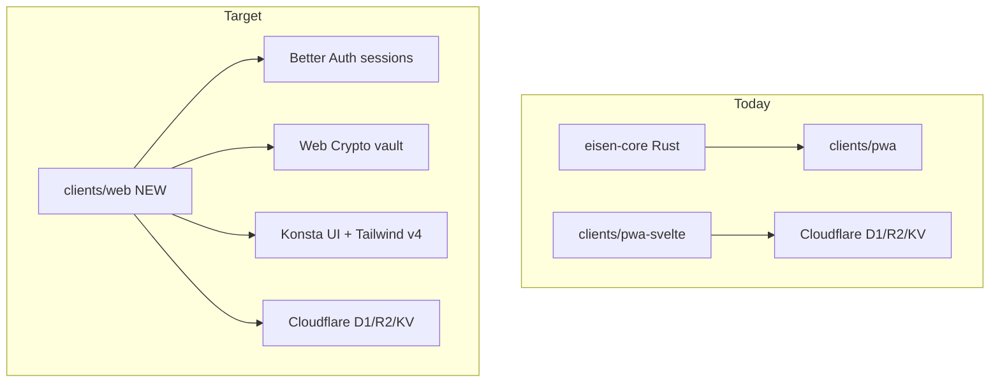
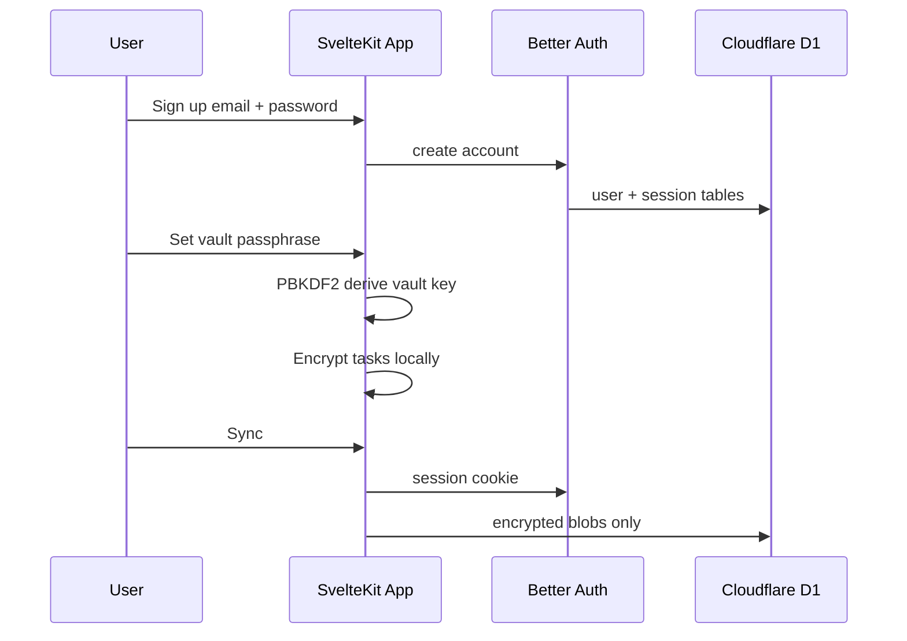

# Eisen Rebuild: SvelteKit + Konsta + Better Auth

## Current state

Eisen is a local-first Eisenhower-matrix task app with **three client tracks**:


| Track                       | Location                                     | Status                                           |
| --------------------------- | -------------------------------------------- | ------------------------------------------------ |
| Leptos PWA + Rust WASM core | `[clients/pwa/](clients/pwa/)`               | Official per phasing plan; full E2EE protocol    |
| SvelteKit PWA               | `[clients/pwa-svelte/](clients/pwa-svelte/)` | Active; Dexie + Web Crypto + Cloudflare D1/R2/KV |
| Android (Kotlin)            | `[clients/android/](clients/android/)`       | Reference UI only                                |


You want a **fresh scaffold** (not extend `pwa-svelte`), with **Better Auth**, **encrypted user data**, and **notifications**, while **dialing back Rust and the full E2EE protocol**.




## What we dial down vs keep

**Remove / do not port:**

- `[core/](core/)` Rust crate (Ed25519 envelopes, X25519 pairing, OPFS store, epoch keys)
- `[clients/pwa/](clients/pwa/)` Leptos client
- Spec'd but unimplemented auth protocol in `[docs/specs/account-enrollment-auth.md](docs/specs/account-enrollment-auth.md)`
- 6-char KV pairing flow (replaced by Better Auth multi-device sessions)

**Keep (simplified TypeScript version):**

- Local-first: Dexie/IndexedDB for plaintext task UI
- Encrypt task JSON before sync → opaque blobs in D1 `vault_records` (pattern from `[clients/pwa-svelte/src/lib/sync.ts](clients/pwa-svelte/src/lib/sync.ts)`)
- Cloudflare stack: D1 + R2 + Workers/Pages (per `[docs/adr/012-server-stack.md](docs/adr/012-server-stack.md)`)
- Eisenhower matrix UX (Android is the reference; see `[docs/research/pwa-svelte-ui-ux-implementation-plan.md](docs/research/pwa-svelte-ui-ux-implementation-plan.md)`)
- Recovery export (encrypted backup packages to R2)

**Add:**

- Better Auth email/password on Cloudflare D1 via Kysely D1 dialect ([Better Auth docs](https://better-auth.com/docs/adapters/other-relational-databases))
- Konsta UI v5 mobile shell (requires Tailwind v4 + Svelte 5 runes)
- Web Push notification pipeline (wake-clock pattern from `[docs/research/pwa-native-feasibility.md](docs/research/pwa-native-feasibility.md)`)

## Konsta UI v5 — verified from official docs

Re-checked [konstaui.com/svelte](https://konstaui.com/svelte) (current: **v5.3.0**, July 2026). Several details differ from older guides and the Capgo skill in the repo.

### Setup (Tailwind v4 — no `tailwind.config.js`)

Konsta v5 uses Tailwind v4's CSS-first config. There is **no** `konsta/config` wrapper in `tailwind.config.js` anymore.

```css
/* src/app.css */
@import 'tailwindcss';
@import 'konsta/svelte/theme.css';

@theme {
  --color-brand-primary: #007aff;
  /* Eisenhower quadrant colors — applied via k-color-brand-* classes */
  --color-brand-red: #ef4444;    /* Do Now */
  --color-brand-amber: #f59e0b;  /* Schedule */
  --color-brand-blue: #3b82f6;   /* Delegate */
  --color-brand-gray: #6b7280;   /* Eliminate */
}
```

Roboto font is required for the Material theme ([installation docs](https://konstaui.com/svelte/installation)); iOS theme uses system font.

### Svelte 5 patterns (official examples use these, not the older SvelteKit guide)

The [SvelteKit integration page](https://konstaui.com/svelte/svelte-kit) still shows `<slot />` — that is **outdated**. Current v5 component examples use:

- `$state()` / `$derived()` runes for reactive state
- `{#snippet name()}...{/snippet}` instead of named slots
- `onclick` handler props (not `on:click`)
- SvelteKit layout should use `{@render children()}` inside `<App>`, not `<slot />`

```svelte
<!-- src/routes/+layout.svelte -->
<script lang="ts">
  import '../app.css';
  import { App } from 'konsta/svelte';
  let { children } = $props();
</script>

<App theme="ios" safeAreas>
  {@render children()}
</App>
```

### App component globals

| Prop | Default | Notes |
|------|---------|-------|
| `theme` | `'material'` | `'ios'`, `'material'`, or `'parent'` |
| `safeAreas` | `true` | Handles notch/home-indicator insets |
| `dark` | `false` | Enables dark mode variants |
| `iosHoverHighlight` | `true` | iOS touch highlight (can disable globally) |
| `materialTouchRipple` | `true` | Material ripple (can disable globally) |

Recommend `theme="ios"` for Eisen to match the Android reference app's iOS-like feel, or `theme="material"` for Android Material look. Can also add `k-md-vibrant` / `k-md-monochrome` on wrapper elements for Material color schemes.

### Navigation drawer → `Panel`

Konsta has **no** `ModalNavigationDrawer`. Use [`Panel`](https://konstaui.com/svelte/panel) (left/right side panel with backdrop):

```svelte
<Panel side="left" opened={drawerOpen} onBackdropClick={() => (drawerOpen = false)}>
  <Page>
    <Navbar title="Eisen">
      {#snippet right()}
        <Link iconOnly onclick={() => (drawerOpen = false)}>×</Link>
      {/snippet}
    </Navbar>
    <List strong inset>
      <ListItem link title="Home" href="/" />
      <ListItem link title="History" href="/history" />
      <ListItem link title="Settings" href="/settings" />
    </List>
  </Page>
</Panel>
```

Hamburger icon goes in `Navbar` `{#snippet left()}` on main pages.

### Eisenhower ledger → `List` + `ListGroup`

[`List`](https://konstaui.com/svelte/list) with `ListGroup` + `groupTitle` + sticky headers maps directly to the four quadrants:

```svelte
<List strong outline>
  <ListGroup>
    <ListItem title="Do Now" groupTitle class="ios:top-safe-15 sticky k-color-brand-red" />
    <ListItem link title={task.title} href="/task/{task.id}" />
  </ListGroup>
  <!-- repeat for Schedule, Delegate, Eliminate -->
</List>
```

`ListItem` supports `checkbox`, `toggle`, `after` (badge/icons), `media`, `subtitle`, `text` snippets — enough for task rows with pin/reminder/complete.

### FAB, undo, and in-app feedback

- [`Fab`](https://konstaui.com/svelte/fab): fixed with safe-area classes (`bottom-safe-4 right-safe-4`); icon via `{#snippet icon()}`
- [`Toast`](https://konstaui.com/svelte/toast): in-app undo snackbars (complete/archive actions)
- [`Dialog`](https://konstaui.com/svelte/dialog): discard-confirmation on composer

### Icons

Official examples use `framework7-icons/svelte` (iOS) + custom Material SVGs via `useTheme()`. `@lucide/svelte` (used in `pwa-svelte`) works but won't match Konsta's native look. Research doc should pick one strategy.

### Critical: Konsta `Notification` ≠ OS push notifications

[`Notification`](https://konstaui.com/svelte/notification) is an **in-app** push-style banner (like iOS notification preview in the app). It does **not** replace Web Push / service worker `showNotification()` for reminders when the PWA is closed.

| Use case | Component / API |
|----------|----------------|
| Undo snackbar after complete/archive | Konsta `Toast` |
| In-app alert banner | Konsta `Notification` or `Dialog` |
| Reminder when PWA is closed/backgrounded | Web Push + service worker `registration.showNotification()` (see Phase 5) |

## Target auth + encryption model

Two layers — this is the key design decision for the research doc:




| Layer                | Purpose                           | Storage                                                                          |
| -------------------- | --------------------------------- | -------------------------------------------------------------------------------- |
| **Better Auth**      | Identity, sessions, device trust  | D1 auth tables (user, session, account)                                          |
| **Vault passphrase** | Encrypt/decrypt tasks + user data | Salt + validation token local; key in memory or optional "keep unlocked" session |


- Better Auth session gates all API routes (`event.locals.user`)
- Vault must be unlocked separately to read/write tasks (same UX pattern as today, but account recovery is possible via Better Auth password reset — vault data is **not** recoverable without the vault passphrase, which must be communicated clearly at onboarding)
- Sync API changes: `ownerId` becomes `user.id` from Better Auth; device enrollment becomes session-based (no manual pairing codes)

## Notifications architecture

Exact-time reminders while the PWA is closed **cannot** be done purely offline (`[docs/research/android-notifications.md](docs/research/android-notifications.md)`). The E2EE-compatible approach already researched:

1. Client computes next `reminderAt` from local decrypted tasks
2. Client POSTs opaque wake schedule: `{ deviceId, wakeAt, nonce }` — **no task content**
3. Worker sends generic Web Push at `wakeAt` (VAPID keys in Worker secrets)
4. Service worker wakes, reads local session key from IndexedDB, decrypts due reminders, calls `showNotification()`

This preserves E2EE: server never sees task titles or reminder text.

## Phase 0: Research doc (your chosen starting point)

Produce `[docs/research/sveltekit-konsta-better-auth-rebuild.md](docs/research/sveltekit-konsta-better-auth-rebuild.md)` covering:

1. **Stack integration** — SvelteKit 2 + Svelte 5 + Tailwind v4 (`@theme` CSS, no `tailwind.config.js`) + Konsta v5.3 + `@sveltejs/adapter-cloudflare` + `@vite-pwa/sveltekit`; Roboto font for Material theme
2. **Konsta UI patterns** — App wrapper, Panel drawer, List/ListGroup for Eisenhower sections, Fab/Toast/Dialog; Svelte 5 snippets (not slots); quadrant colors via `--color-brand-*` + `k-color-brand-*`; icon strategy (framework7-icons vs lucide)
3. **Better Auth on D1** — two viable paths (research doc should compare):
   - **Official**: `better-auth` + community `kysely-d1` dialect
   - **Cloudflare-native**: [`better-auth-cloudflare`](https://github.com/zpg6/better-auth-cloudflare) — D1 + optional KV via `withCloudflare()`, Drizzle adapter, built-in rate limiting (Context7: `/zpg6/better-auth-cloudflare`, 460 snippets)
   - Both need `src/hooks.server.ts` with `svelteKitHandler` + manual `event.locals` population + `sveltekitCookies(getRequestEvent)` plugin
4. **Vault crypto spec** — PBKDF2/AES-GCM (reuse logic from `[clients/pwa-svelte/src/lib/crypto.ts](clients/pwa-svelte/src/lib/crypto.ts)`); two-layer auth UX wireframes; onboarding copy for "vault passphrase is not recoverable"
5. **D1 schema redesign** — merge Better Auth tables + `vault_records` (scoped by `user_id`); drop `accounts`/`devices`/`pairing` KV in favor of auth sessions + push subscription table
6. **Notification design** — VAPID setup, push subscription storage, wake scheduler Worker cron/queue, service worker handlers
7. **Port map** — what to copy from `pwa-svelte` vs rewrite (db helpers, sync, recovery, routes)
8. **Explicit non-goals** — Rust core, Leptos PWA, Android maintenance, signed envelope protocol

Spin up a background research agent per the research skill; cite primary sources (Better Auth docs, Konsta docs, W3C Push API, existing Eisen ADRs).

## Phase 1: Fresh scaffold

Create `[clients/web/](clients/web/)` with:

```
clients/web/
  src/
    lib/
      auth.ts          # Better Auth instance
      auth-client.ts   # createAuthClient from better-auth/svelte
      db.ts            # Dexie schema (port from pwa-svelte)
      vault.ts         # vault unlock (port + adapt)
      crypto.ts        # Web Crypto helpers (port)
    routes/
      +layout.svelte   # Konsta App wrapper + drawer shell
  src/hooks.server.ts  # Better Auth handler + session locals (NOT under routes/)
    app.css            # @import tailwindcss + konsta/svelte/theme.css
  migrations/          # D1: auth tables + vault_records + push_subscriptions
  wrangler.toml        # D1, R2, KV bindings
  package.json
```

Key dependencies: `better-auth`, `kysely`, `kysely-d1`, `konsta`, `tailwindcss@4`, `dexie`, `@vite-pwa/sveltekit`, `web-push` (Worker-side).

## Phase 2: Auth + vault onboarding

- Sign up / sign in pages (Konsta `Page`, `List`, `ListInput`, `Button`)
- Post-signup vault passphrase setup (one-time)
- Unlock screen on return visits
- Protect routes: auth required for app shell; vault unlock required for task routes
- Port and fix known bugs from `[docs/research/auth-implementation-plan.md](docs/research/auth-implementation-plan.md)` (no pairing-code vault wipe)

## Phase 3: Task UI (Konsta shell)

Rebuild Android-matching screens using Konsta components instead of custom CSS:


| Route        | Konsta building blocks                               |
| ------------ | ---------------------------------------------------- |
| `/`          | `Page`, `Navbar`, `Fab`, `List`, `ListItem`, `Block` |
| `/new-task`  | `ListInput`, `Segmented`, `Toggle`                   |
| `/task/[id]` | `List`, `ListInput`, `Toggle`                        |
| `/history`   | `Segmented` tabs + `List`                            |
| `/settings`  | `List`, `Toggle`, `Block`                            |


Reference: `[docs/research/pwa-svelte-ui-ux-implementation-plan.md](docs/research/pwa-svelte-ui-ux-implementation-plan.md)` phases 1–7.

## Phase 4: Encrypted sync + recovery

- Port sync layer from `[clients/pwa-svelte/src/lib/sync.ts](clients/pwa-svelte/src/lib/sync.ts)`, replacing `ownerId`/`deviceId` checks with Better Auth session
- Port recovery from `[clients/pwa-svelte/src/lib/recovery.ts](clients/pwa-svelte/src/lib/recovery.ts)`
- R2 backup endpoint (encrypted packages only)

## Phase 5: Notifications

- `Notification.requestPermission()` + PushManager subscribe in settings
- Store push subscription in D1 per user/device
- Worker cron or Durable Object alarm for wake scheduling
- Custom service worker `push` + `notificationclick` handlers in Vite PWA config
- E2E test: set reminder, verify notification fires (Playwright + emulator per `[docs/research/android-notifications.md](docs/research/android-notifications.md)`)

## What happens to existing clients


| Path                     | Recommendation                                                                |
| ------------------------ | ----------------------------------------------------------------------------- |
| `clients/pwa-svelte/`    | Keep as reference during rebuild; deprecate once `clients/web` reaches parity |
| `clients/pwa/` + `core/` | Freeze; no new work                                                           |
| `clients/android/`       | UX reference only; no changes                                                 |
| `docs/research/*`        | New research doc joins existing collection                                    |


## Optional follow-up: project subagent

After the research doc is approved, create `[.cursor/agents/eisen-web-rebuild.md](.cursor/agents/eisen-web-rebuild.md)` with:

- Stack conventions (Konsta v5 snippets, Better Auth patterns, no Rust)
- Port checklist from `pwa-svelte`
- Security invariants (no plaintext tasks on server, no keys in logs)

This gives you a reusable agent for phased implementation without re-explaining context each session.

## Risks to flag in research

- **Vault passphrase loss** = data loss (unlike Better Auth password reset). Onboarding must be explicit.
- **iOS push** requires installed PWA + iOS 16.4+; periodic background sync not available on Safari.
- **D1 transactions**: Better Auth SCIM needs interactive transactions (not needed for email/password launch).
- **Konsta v5 + Tailwind v4** is confirmed via Context7 (`/websites/konstaui_svelte`, 496 snippets). Official SvelteKit guide still shows `<slot />` — use Svelte 5 `{@render children()}` instead.
- **Better Auth on Cloudflare**: evaluate `better-auth-cloudflare` vs raw `kysely-d1` during research (Context7: `/zpg6/better-auth-cloudflare` has 460 snippets, D1 + Drizzle patterns).

